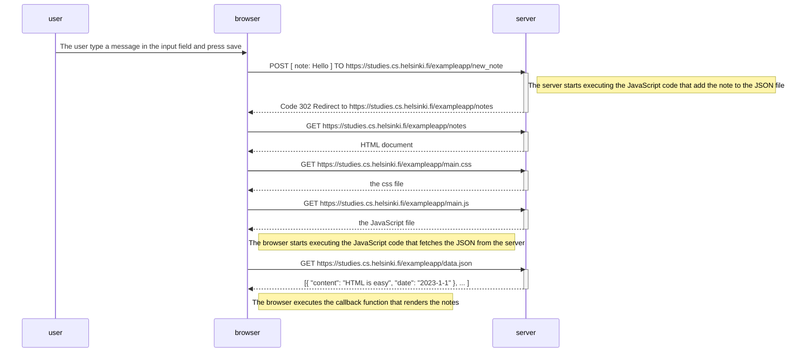

```mermaid 

sequenceDiagram
    participant user
    participant browser
    participant server

    user->>browser: The user type a message in the input field and press save

    browser->>server: POST [ note: Hello ] TO  https://studies.cs.helsinki.fi/exampleapp/new_note
    activate server
    Note right of server: The server starts executing the JavaScript code that add the note to the JSON file
    server-->>browser: Code 302  Redirect to https://studies.cs.helsinki.fi/exampleapp/notes    
    deactivate server

    browser->>server: GET https://studies.cs.helsinki.fi/exampleapp/notes
    activate server
    server-->>browser: HTML document
    deactivate server

    browser->>server: GET https://studies.cs.helsinki.fi/exampleapp/main.css
    activate server
    server-->>browser: the css file
    deactivate server

    browser->>server: GET https://studies.cs.helsinki.fi/exampleapp/main.js
    activate server
    server-->>browser: the JavaScript file
    deactivate server

    Note right of browser: The browser starts executing the JavaScript code that fetches the JSON from the server

    browser->>server: GET https://studies.cs.helsinki.fi/exampleapp/data.json
    activate server
    server-->>browser: [{ "content": "HTML is easy", "date": "2023-1-1" }, ... ]
    deactivate server

    Note right of browser: The browser executes the callback function that renders the notes

```