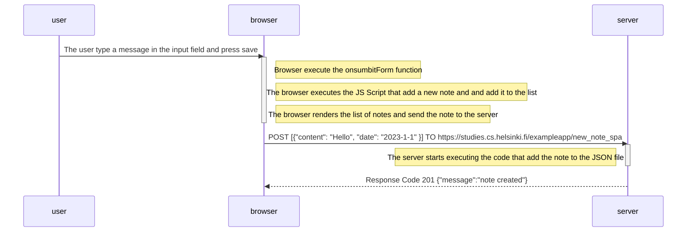

```mermaid 

sequenceDiagram
    participant user
    participant browser
    participant server

    user->>browser: The user type a message in the input field and press save
    activate browser
    Note right of browser: Browser execute the onsumbitForm function
    Note right of browser: The browser executes the JS Script that add a new note and and add it to the list
    Note right of browser: The browser renders the list of notes and send the note to the server
    deactivate browser

    browser->>server: POST [{"content": "Hello", "date": "2023-1-1" }] TO  https://studies.cs.helsinki.fi/exampleapp/new_note_spa
    activate server
    Note left of server: The server starts executing the code that add the note to the JSON file
    deactivate server
    server-->>browser: Response Code 201 {"message":"note created"}
    
```